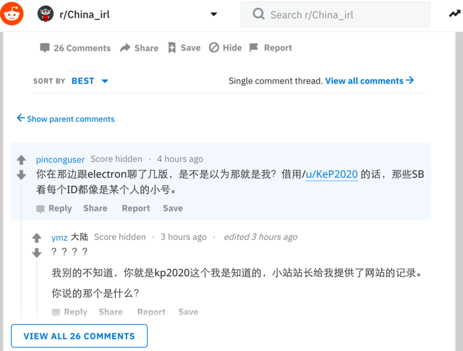
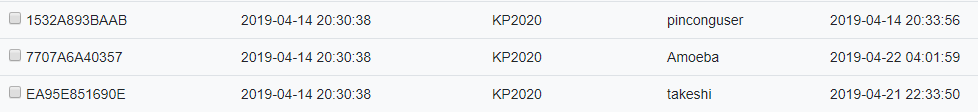

* [PDF版本](./KFQ_China_irl_Background_Security_Analysis.pdf)
* [Reddit版本](https://www.reddit.com/r/saraba1st/comments/bgni7i/%E5%BC%80%E6%94%BE%E5%8C%BA%E5%B0%8F%E7%AB%99%E5%92%8Crchina_irl%E7%9A%84%E8%83%8C%E6%99%AF%E5%8F%8A%E5%AE%89%E5%85%A8%E6%80%A7%E6%B5%85%E8%AF%84/)
* [电报版本](https://telegra.ph/%E5%BC%80%E6%94%BE%E5%8C%BA%E5%B0%8F%E7%AB%99%E5%92%8CrChina-irl%E6%98%AF%E5%85%B1%E9%9D%92%E5%9B%A2%E7%9A%84%E5%A4%A7%E5%A4%96%E5%AE%A3%E9%A1%B9%E7%9B%AE-04-23)
* [Archive版本](https://archive.is/WAMaO)

# [开放区小站和r/China_irl的背景及安全性浅评](https://newjrs.github.io)
匿名人士，2019-4-23

## 零、背景介绍

开放区小站（newjrs.xyz）和Reddit的r/China_irl子版是一个论坛的墙(GFW)内外两个分支。据站方自称原虎扑网论坛讨论时政话题为主的开放区板块。在中国大陆言论日趋收紧的背景下被虎扑网关闭，原版主到Reddit建立了r/China_irl子版块(简称China_irl)，并将备份的历史数据导入r/kfq板块后，又搞到一台位于美国境内的服务器并建了‘开放区小站’（newjrs.xyz）。虽然似乎开放区小站的服务器设在境外，但并未被墙（故以下用‘墙内小站’代称）。其中China_irl的主要版主是ymz而墙内小站站长叫grogery。China_irl在初期受到中文网友大量关注并很快有约3.6k左右用户加入，彼时正值大陆两会期间，版主ymz因转发大量中共官方对两会的新闻，而获得翻墙自干五的美名。

这个自诩为“开放区流浪站”的论坛真是中共言论管制的受害者吗？部分以键委(jr)自称的开放区活跃用户是真‘自干五’亦或另有任务？这个小站对海内外普通网友而言真的安全吗？那让我们来分析一下这个所谓流浪站的运营特点和用户成分，并浅析该站的背景、目的和潜在安全风险，供网友们参考。

## 一、运营原则：内容审查

新开放区的墙内外小站都有事前审核制度——只有通过审核的内容才能被展示。具体而言，China_irl共有7个真人版主做内容审查，墙内小站则采用关键字自动过滤，其关键字有：近平、恩来、晓波、翻墙、学运、新疆、西藏等。后者相对前者较宽松，因为可以用近-平、近ping等简易方式绕过自动审查。相比之下，可匿名浏览的China_irl的人工事前审查则严格得多：除‘五毛’等关键字无法发出外，政治倾向和观点不符合‘爱国爱党’标准的内容也难被发布。除事前审查外，墙内外的小站也有事后审查，如版规中的‘针对首先发起人身攻击的用户采取封禁措施’。

除站方的内容审查外，老用户们即遍在墙外发言也习惯自我审查和用黑话。例如，用‘八平方’指代‘六四’，用11指代习近平。这种习惯性的自我审查和黑话是常年在墙内高压环境下活动的网友具备的典型语言特征。反观自由的中文reddit子版r/saraba1st，网友一般很少用这类黑话和自我审查的习惯。

## 二、对话题与政治倾向的引导
‘开放区’的内容审查是为控制话题范围服务，这一定程度揭示出其舆论引导的使命（根据2004年在大陆出版的解析前苏联意识形态控制体系的《论意识操纵》中提及的设置左和右的言论边界以实现框定人们思想范围，并且创造一个言论自由的假象）。在中国大陆，所谓“南方系”，“新京报”等右翼媒体跟‘察网’，‘红色中国’之类左翼媒体都是朝廷的意识形态部门用以设定言论边界的几块石头。对长期处于墙内的观众而言，这些左右派别的媒体间看似热闹的论战实际都在官方设计的范围以内，边界外的内容是绝无机会出现在读者眼里。

根据传播学的议程设置理论，通过对设定话题的大量正反两面报道能有效引导公众的注意力，进而人为抬高某类话题的心理重要性，通俗的说就是炒作。炒作是另一种思维引导，它的精髓在对话题的限制而不是对特点话题的观点的限制，争论的氛围正是炒作成功的关键。这种手法为开放区小站所精通。开放区小站中，看似对国家和政府的时事既有赞美也有有限批评，颇有言论自由的幻觉，实际上那些被活跃用户(Agents)转载的新闻话题都紧跟中宣部的指挥。其最终效果是让用户产生‘党的出发点是好的’，‘大政方针是英明的’，‘有问题是因基层执行不力’，即使不完美但终究‘瑕不掩瑜’。

一旦某些用户发布过多官方议程之外的内容，论坛中的活跃份子(Agents)便会对其打上各种标签，或刻意挑衅并激怒‘异议份子’，而管理员则迅速‘依据版规’将异议分子禁言。小站这套开黑店的组合拳打得非常专业。部分活跃份子（如jayjoke）对版规边界的把握非常精准，人身攻击的手法非常专业，并采用高度组织化的狼群战术，仿佛受过刑讯逼供训练的公安国安。此外，许多活跃份子所用攻击手法均具有同样模式：例如用‘毫无兴趣’之类的短、冷留言进行心理打击，故意歪楼，将讨论引至无关紧要的细节争论，还有断章取义、贴标签、直接辱骂等教科书式的网军操作。而这些站方自己人的言论无论是否越过版规红线，管理员都一律放任，看似拉偏架实则开黑店。

这个所谓开放区的两个分站内所采取的内容审核、话题引导、人身攻击等组合手段，是中共意识形态控制的标准模式，是从苏联开始近一个世纪积累下的‘无形资产’。至此，可见该网站的使命是操控引导用户思想。

## 三、活跃用户的背景
开放区活跃用户不仅大多来自中国大陆，还带着明显的中共体制内包括共青团组织的行事风格和态度。

**第一，用户普遍具有典型的体制内视角。** 这些活跃份子的思维跟心态都是站在统治阶级的角度看问题，动辄争夺世界霸权、大国崛起、武统台湾、地缘政治、如何更好的维稳和搞舆论管控，这些都是体制内人员的典型特征。众多话题中，唯一从个人角度考虑的是谈论官场八卦或公务员考试。这同普通民众一般从自身出发，关注自身权益、前途、生活、移民等话题截然相反。更有意思的是这里的活跃用户明明论坛在当局压力下被关闭而流浪到此，还在一如既往为统治者分忧解难。不难看出，开放区活跃用户背景以体制内人员和在校大学生中有意仕途者为主。

**第二，共青团痕迹。** 证明这些Agent是具有共青团背景的关键是他们对共青团内部秘密被泄露时的反应。在笔者故意泄露‘2012年共青团参与组织反日游行’这条其实墙外人尽皆知但共青团以为是内部的秘密时，有个用‘学习强国’应用图标为头像的jayjoke立刻对笔者发出两条人身威胁，随后自觉此地无银三百两而又主动删掉，可惜消息系统保留了这条留言。而这个jayjoke(疑似Reddit ID: WhosYourDarling）也是后来攻击笔者最卖力、展现出最专业的人身攻击技巧，同时在线时间非常长，并最积极转发各类新闻兜售中共的官方叙事，最积极攻击其他正常用户，到处指鹿为马为中共洗地。

**第三，用户态度的体制内痕迹。** 证明小站站长和活跃Agents为官方背景的另一个证据是他们的官僚气息。中国大陆的官员都习惯了下级和百姓面前当大爷，领导面前当孙子的官场文化。这种文化也在这些网评员和管理员的习惯中充分展示出来。例如ymz对用户禁言处理时，毫无警告，毫无理由。又如在封禁用户时采用标准非常主观，毫无规则的观念和常识，他们处理都是根据用户的言论判断其倾向和背景，以此处理，而非从规则出发考虑问题。例如对非自己人的用户在小站以外的疑似发言都要管，而对‘自己人’的违规则有意忽略，这种行为模式都是体制内长年专注内斗的标本。

**第四，用户网络技术的体制内痕迹。** 官方网评员一般来自体制内，因此除少数专家外，他们的网络技术和知识大都非常贫乏。中共的体制是个逆向淘汰系统，专长业务的人都不会选择这种恶臭之处受气。所以，体制内的五毛党们既无学习网络技术的动力，也没有这个必要（无因言获罪之担忧），更没有学习的智力和精力。此外，中共为控制基层也不愿让体制内的普通人掌握高端的翻墙和匿名技术。在言论高压下，很难想象一个平日热衷评论时政的普通人会对翻墙和匿名技术毫无兴趣。而当他们觉得会被‘出道’时又怕得要死。开放区的大部分用户连基本的翻墙手段都没有，可见即便是网评员，中共也极力防止其掌握独立自主的信息渠道。

**第五，论坛版主身份实名制。** 中国大陆的所有论坛和网站从2013年开始实施用户实名制，并于2017年立法强制实施。因此虎扑网的那些版主的真实身份必然早已被中共掌握，事实上大陆十多年前就对境内活跃的知名版主们进行了身份排查。如果说这些真实身份早已被当局掌握的版主们换了个海外服务器就突然敢于枉议时政，你信吗？再者，能在实名制下长期活跃于时政评论，并担任论坛版主的网友，你真的相信他们不是带着任务，不会配合中共吗？

## 附：中共的网络舆论控制体系

中共的网络舆论管控体系包含了两个方面，审查和引导。网络言论审查（删帖）主要交给审查公司完成，这方面已经有两篇对审查产业的新闻报道。

[济南：崛起的互联网审核之都](https://archive.is/lZ9Wj)

[济南，新的互联网审核之都](https://archive.is/JgYOr)

根据另一篇[针对网评员培训的爆料](https://archive.li/YbWpL)，网络评论员的主要来源是在校大学生，共青团系统，还有工会，宗教团体，退役军人，各种国企和事业单位。而早在两年前中共已经对体制内和高校人员的社交媒体账号完成了搜集。很难想象这些体制内的人士会在近乎裸奔的上网条件下“自由”、“无约束”的发表政见。

## 四、开放区小站的封闭性和对用户的数据搜集
开放区小站的名字本身就非常讽刺，取名‘开放区’，实际是非请勿入，讨论内容还无法匿名浏览，这跟自由世界的Reddit或品葱截然相反，跟‘人民日报’为党喉舌，‘朝鲜民主主义人民共和国’除了朝鲜什么都没有完全是异曲同工。

除了全封闭模式以外，开放区小站出售的邀请码会将每个使用邀请码注册的用户均关联到其邀请人。由于普通用户通常会送邀请码给自己现实生活中的朋友，这种邀请码关联制度将用户的社交关系送给站方，进而大大提高了真实身份暴露的风险。用户现实生活中的社交关系网络被站方控制，那么站方是否会对用户的数据保密呢？完全没有。大家可从以下对话看出 **小站实际在尽量搜集用户的数据** ，__如浏览器指纹，登陆IP，登陆时间，用户之间的邀请关系等__ ，并且仅因为站长不开心就可以这些数据随意发布。

上图为ymz获得的KP2020邀请码关联用户，他根据时间戳断定pinconguser是KP2020的小号。

** 看到这里，如果你是一个自由派或异见人士，你还敢访问这种明目张胆的钓鱼网站吗？** 

** 如果你觉得自己思想正常，但你怎么知道什么时候标准变了而你成为“异议”人士？ ** 

KP2020还仅仅是一个不受欢迎的用户，小站就可以将所有数据分享出去，那如果是公安、国安单位查询呢？如果你是一个疑似身在海外他们感兴趣的目标人物，你的登陆浏览点击数据会泄露多少数据？

除了搜集海内外中文用户的计算机数据，对体制内漏网之鱼进行洗脑，共青团建设这个小站还有吸收外部思想，了解学习海外异议人士思维与互动模式。其内部夸张的跪舔姿势也显示出开放区小站为中共网评员自娱自乐刷业绩的平台。

## 五、写在最后
在中共意识形态已急剧左转的2019年，在这个举报泛滥，敢言学者被四处打压的文革2.0年代，中共还在试图通过国际公关公司和体制内培训的网军五毛们去 **抢占海外舆论阵地** 。像用户[ymz](https://archive.is/8WriA)和[WhosYourDarling](https://archive.is/AXONG) 这种用户的言行为网友提供了一个识别五毛的标本。同时这个所谓开放区小站的全封闭管理、事前审核、五毛集结、并有疑似国宝公安人员作活跃用户和版主的特征为世界提供了一个中共对外扩张影响力和搜集海内外华人个人数据的橱窗式案例。

网友们在加入一个网站之前，要仔细考察网站的背景和运营模式，并且做好匿名防护措施。尤其是在访问带中国背景的网站或手机应用时，请务必[使用Tor和双虚拟机等隐藏自己真实身份的安全措施](https://archive.is/U0XXB)，最好在加入前实施至少3个月以上的长期观察，防止敏感数据被中共搜集，如果无法观察则千万别乱入。

中共的体制是一个内耗斗争型系统，具有原创力的人都会被首先淘汰，剩下的都是内斗专家业务白痴。这样的体制无法独立存在，它要么依赖外部源源不断的输血（朝鲜），要么需要从外部不断吸血（偷窃知识和技术以保持活力）。但内耗型的中共体制中的人是憎恨那些具有原创能力的人才的，在利用完毕之后都会被斗倒批臭、一脚踢开。那些对体制抱有幻想的人，请参见[历史上那些归国为中共服务的顶级人才的下场](https://archive.is/lbpPE)。

强烈建议用KP2020邀请码注册newjrs.xyz的用户立即停用账号。

一家之言，难免浅薄，请各位自行判断、评论。

## 附：其它观点和后续
1. [冯哲盈、冯晓宇 : 社交媒体时代的网络民族主义](https://web.archive.org/web/20190501191958/http://zhanlve.org/?p=6844)
2. [由哈佛、斯坦福、加州大学圣迭戈分校的三位政治学者对五毛的研究论文](https://archive.md/dZysi)： King, Gary, Pan, Jennifer and Margaret E. Roberts. 2017. “How the Chinese Government Fabricates Social Media Posts for Strategic Distraction, not Engaged Argument.” American Political Science Review 111(3): 484-501. 2017. ([PDF](https://web.archive.org/web/20190519005725/http://jenpan.com/jen_pan/50c.pdf), [Replication](https://web.archive.org/web/20190519005725/https://dataverse.harvard.edu/dataset.xhtml?persistentId=doi:10.7910/DVN/QSZMPD))
    >长期以来，中国政府一直被怀疑雇用多达200万人，暗中将大量的假名和其他欺骗性文章插入真实的社交媒体帖子中，好像他们是普通人的真实意见。

    >我们将这些活动解释为政权在战略上对（公众的）集体行动、不满、或普遍的负面反应等进行分散注意力的努力。

    >五毛党似乎主要由政府雇员组成，他们在正常工作之外做兼职，而不是像一般人认为的，由普通公民为的零碎地报酬而工作。尽管如此，这仍然是一支庞大的劳动力队伍，我们估计每年可以产生4.48亿个五毛贴。
3. KP2020: [本文涉及帐号在newjrs.xyz内接收消息原始数据](./message.md)
4. KP2020: [针对网评员培训师的爆料--符合美国学者研究结论](https://archive.li/YbWpL)
5. [网上爆出的五毛手册《网评员内部资料(严禁外泄)》](https://pincong.rocks/article/756)
6. Reddit用户[fengli03](https://www.reddit.com/user/fengli3):[说一下虎扑防区，以及最近兴起的r/China_irl版块](https://pincong.rocks/article/1348), [Reddit原文及评论](https://www.reddit.com/r/saraba1st/comments/ax3bq5/%E8%AF%B4%E4%B8%80%E4%B8%8B%E8%99%8E%E6%89%91%E9%98%B2%E5%8C%BA%E4%BB%A5%E5%8F%8A%E6%9C%80%E8%BF%91%E5%85%B4%E8%B5%B7%E7%9A%84rchina_irl%E7%89%88%E5%9D%97/)
7. Reddit用户[Topdeckdog](https://www.reddit.com/user/Topdeckdog): [不要太自以为是了。口头警告。 removed comments: 16/34 (47.1%)](https://www.reddit.com/r/saraba1st/comments/bmi86r/%E4%B8%8D%E8%A6%81%E5%A4%AA%E8%87%AA%E4%BB%A5%E4%B8%BA%E6%98%AF%E4%BA%86%E5%8F%A3%E5%A4%B4%E8%AD%A6%E5%91%8A_removed_comments_1634_471/)， [触怒党国被删之贴](https://www.removeddit.com/r/China_irl/comments/bmbxkn/%E8%B7%AF%E9%80%8F%E7%A4%BE%E4%B8%AD%E5%9B%BD%E4%BB%8E%E8%B4%B8%E6%98%93%E5%8D%8F%E8%AE%AE%E8%8D%89%E6%A1%88%E6%89%BF%E8%AF%BA%E4%B8%8A%E5%85%A8%E9%9D%A2%E5%8F%8D%E6%82%94_%E5%8D%8E%E7%9B%9B%E9%A1%BF%E9%9C%87%E6%80%92%E8%BF%98%E4%BB%A5%E6%9B%B4%E5%A4%9A%E5%85%B3%E7%A8%8E/)
8. 2019-5-14更新，分析显示在品葱捣乱的[支字头跟小站同志是一伙人](https://pincong.rocks/question/4073?rf=false)，因为在揭穿化名looose的脚本王子(~~疑似~~品葱支字头)[熟悉地利用品葱点踩漏洞找出匿名用户，用熟悉的长臂管辖’命令‘品葱管理员处理其他品葱用户](https://web.archive.org/web/20190511211226/https://pincong.rocks/question/3821)后，恼羞成怒的[支字头又用相同的工具和套路对品葱发起了一轮刷屏攻击](https://pincong.rocks/question/4096)，他自己也[承认是为小站而攻击](https://pincong.rocks/article/1573)，并且支字头这次泄露了他在reddit的帐号[abudsalam](https://www.reddit.com/user/abudsalam)，此Troll以前在China_irl[帮版主捧场1](http://www.reddit.com/r/China_irl/comments/avt21o/_/ehhkkzm), [并且放黑屁2](http://www.reddit.com/r/China_irl/comments/axip78/_/ehuczmb)，近期又在[帮朝鲜打造形象](https://web.archive.org/web/20190513143944/https://www.reddit.com/user/abudsalam)(可以研究中共网评员的公关思路)。值得一提的是，此Troll被曝光之后又删掉了以前在China_irl的所有留言，不过还是有备份的。这些后续发展更进一步坐实了本文对墙内小站和China_irl的背景分析。
    >[1做贼心虚删掉捧场原文](http://www.reddit.com/r/China_irl/comments/avt21o/_/ehhkkzm): 几成不重要了，现在订阅超过两千，在线两百，对于一个仓促建立有上网门槛的外文网站板块来说，非常不错了 
    
    >[2做贼心虚删掉黑屁原文](http://www.reddit.com/r/China_irl/comments/axip78/_/ehuczmb): 我打个比方，香港和台湾把政府交给黄志峰和林昶佐会怎样，委内瑞拉的闹剧不过是占中和太阳花革命的拉美版
    
    >附图证明品葱支字头abudsalam是小站和China_irl站长小号的证据：底部有他发小站irl保留节目 __每日新闻__ 的记录，最新的是他发朝鲜美女的记录（还自建两个sub的moderator呢！），因为China_irl已经处于僵尸态。
    -Reddit.png)
9. 2019-5-17更新，  [品葱已有人提议将上门的网评员做成开源数据库](https://pincong.rocks/article/1612)， 绝妙！
10. 2019-5-18, Hymnsin, [墙外流亡中文论坛现况（2019年五月）](https://matters.news/@lzybio/%E5%A2%99%E5%A4%96%E6%B5%81%E4%BA%A1%E4%B8%AD%E6%96%87%E8%AE%BA%E5%9D%9B%E7%8E%B0%E5%86%B5-2019%E5%B9%B4%E4%BA%94%E6%9C%88-zdpuB2tRc2qVrjdqYdp7KhxYpXPi2ss9X5rdo2nzVDMrN7xAe), Matters.news

                            
