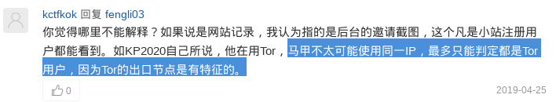
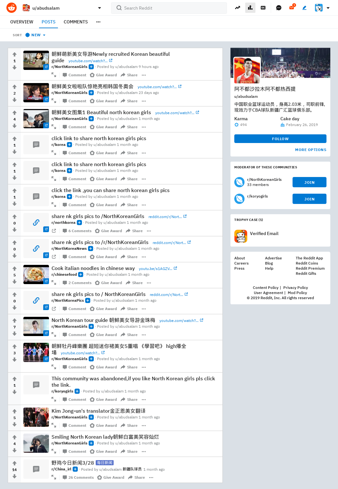
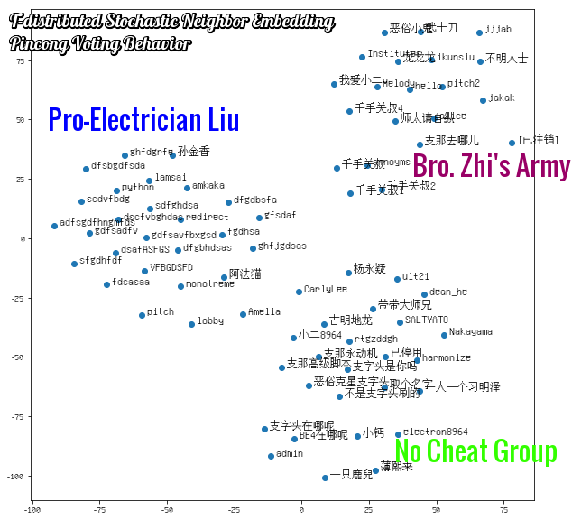

| 其它版本 | PDF | Reddit | Telegra.ph 電報 | IPFS.ink | Archive 存檔 |
|---|---|---|---|---|
| [簡體](https://newjrs.github.io/) | [最新版](./KFQ_China_irl_Background_Security_Analysis_zh-tw.pdf) | [原文](https://www.reddit.com/r/saraba1st/comments/bgni7i/%E5%BC%80%E6%94%BE%E5%8C%BA%E5%B0%8F%E7%AB%99%E5%92%8Crchina_irl%E7%9A%84%E8%83%8C%E6%99%AF%E5%8F%8A%E5%AE%89%E5%85%A8%E6%80%A7%E6%B5%85%E8%AF%84/) | [新版](https://telegra.ph/%E5%BC%80%E6%94%BE%E5%8C%BA%E5%B0%8F%E7%AB%99%E5%92%8CrChina-irl%E7%9A%84%E8%83%8C%E6%99%AF%E5%8F%8A%E5%AE%89%E5%85%A8%E6%80%A7%E6%B5%85%E8%AF%84-06-02)， [原始版](https://telegra.ph/%E5%BC%80%E6%94%BE%E5%8C%BA%E5%B0%8F%E7%AB%99%E5%92%8CrChina-irl%E6%98%AF%E5%85%B1%E9%9D%92%E5%9B%A2%E7%9A%84%E5%A4%A7%E5%A4%96%E5%AE%A3%E9%A1%B9%E7%9B%AE-04-23) | [簡體](https://ipfs.ink/e/QmUQtZxd8ZpPHzP6hxVK2988yfAyPv7idtXQkPq3EUBzjS)，[正體](https://ipfs.ink/e/QmQ3JHfFJ19RxRJt9fyuwjL5qrWpaFzwxiiJ7SyMmqoLxu) | [所有存檔](http://archive.md/https://newjrs.github.io/) |

# [開放區小站和r/China_irl的背景及安全性淺評](./README_zh-tw.md)
匿名人士，2019-4-23

## 零、背景介紹

開放區小站（newjrs.xyz）和Reddit的r/China_irl子版是一個論壇的牆(GFW)內外兩個分支。據站方自稱原虎撲網論壇討論時政話題為主的開放區板塊。在中國大陸言論日趨收緊的背景下被虎撲閘道器閉，原版主到Reddit建立了r/China_irl子版塊(簡稱China_irl)，並將備份的歷史資料匯入r/kfq板塊後，又搞到一臺位於美國境內的伺服器並建了‘開放區小站’（newjrs.xyz）。雖然似乎開放區小站的伺服器設在境外，但並未被牆（故以下用‘牆內小站’代稱）。其中China_irl的主要版主是ymz而牆內小站站長叫goayrton。China_irl在初期受到中文網友大量關注並很快有約3.6k左右使用者加入，彼時正值大陸兩會期間，版主ymz因轉發大量中共官方對兩會的新聞，而獲得翻牆自幹五的美名。

這個自詡為“開放區流浪站”的論壇真是中共言論管制的受害者嗎？部分以鍵委(jr)自稱的開放區活躍使用者是真‘自幹五’亦或另有任務？這個小站對海內外普通網友而言真的安全嗎？那讓我們來分析一下這個所謂流浪站的運營特點和使用者成分，並淺析該站的背景、目的和潛在安全風險，供網友們參考。

## 一、運營原則：內容審查

新開放區的牆內外小站都有事前稽核制度——只有通過稽核的內容才能被展示。具體而言，China_irl共有7個真人版主做內容審查，牆內小站則採用關鍵字自動過濾，其關鍵字有：近平、恩來、曉波、翻牆、學運、新疆、西藏等。後者相對前者較寬鬆，因為可以用近-平、近ping等簡易方式繞過自動審查。相比之下，可匿名瀏覽的China_irl的人工事前審查則嚴格得多：除‘五毛’等關鍵字無法發出外，政治傾向和觀點不符合‘愛國愛黨’標準的內容也難被髮布。除事前審查外，牆內外的小站也有事後審查，如版規中的‘針對首先發起人身攻擊的使用者採取封禁措施’。

除站方的內容審查外，老使用者們即遍在牆外發言也習慣自我審查和用黑話。例如，用‘八平方’指代‘六四’，用11指代習近平。這種習慣性的自我審查和黑話是常年在牆內高壓環境下活動的網友具備的典型語言特徵。反觀自由的中文reddit子版r/saraba1st，網友一般很少用這類黑話和自我審查的習慣。

### 備註(2019-05-23)：
* 注1：r/China_irl的7個真人mod，除ymz負責專職線上互動外，其餘6人在reddit幾乎沒有任何發言，據很多[網友反映其幾乎是實時稽核](https://archive.li/aLVQV#selection-5415.1-5400.15)，故[很多網友認為其mod團隊為專業化運作（“拿錢辦事”）](https://pincong.rocks/article/1659)。
* 注2：r/saraba1st 近期也因為版主[susika](https://www.reddit.com/user/susika)的審查模式而[備受爭議](https://pincong.rocks/article/1659)，有網友認為其已淪陷並號召原使用者轉移至[r/saraba2nd](https://www.reddit.com/r/saraba2nd)。而筆者認為r/saraba1st目前症狀與China_irl前期相似，溫水煮青蛙的模式以防止使用者突然大量流失，但還需進一步觀察證實。

## 二、對話題與政治傾向的引導
‘開放區’的內容審查是為控制話題範圍服務，這一定程度揭示出其輿論引導的使命（根據2004年在大陸出版的解析前蘇聯意識形態控制體系的《論意識操縱》中提及的設定左和右的言論邊界以實現框定人們思想範圍，並且創造一個言論自由的假象）。在中國大陸，所謂“南方系”，“新京報”等右翼媒體跟‘察網’，‘紅色中國’之類左翼媒體都是朝廷的意識形態部門用以設定言論邊界的幾塊石頭。對長期處於牆內的觀眾而言，這些左右派別的媒體間看似熱鬧的論戰實際都在官方設計的範圍以內，邊界外的內容是絕無機會出現在讀者眼裡。

根據傳播學的議程設定理論，通過對設定話題的大量正反兩面報道能有效引導公眾的注意力，進而人為抬高某類話題的心理重要性，通俗的說就是炒作。炒作是另一種思維引導，其精髓在於控制話題範圍而非限制特定話題下的觀點，有效的炒作需要營造爭論的氛圍而非單向灌輸。這種手法為開放區小站所精通。開放區小站中，看似對國家和政府的時事既有讚美也有有限批評，頗有言論自由的幻覺，實際上那些被活躍使用者(Agents)轉載的新聞話題都緊跟中宣部的指揮。其最終效果是讓使用者產生‘黨的出發點是好的’，‘大政方針是英明的’，‘有問題是因基層執行不力’，即使不完美但終究‘瑕不掩瑜’。

一旦某些使用者釋出過多官方議程之外的內容，論壇中的活躍份子(Agents)便會對其打上各種標籤，或刻意挑釁並激怒‘異議份子’，而管理員則迅速‘依據版規’將異議分子禁言。小站這套開黑店的組合拳打得非常專業。部分活躍份子（如jayjoke）對版規邊界的把握非常精準，人身攻擊的手法非常專業，並採用高度組織化的狼群戰術，彷彿受過刑訊逼供訓練的公安國安。此外，許多活躍份子所用攻擊手法均具有同樣模式：例如用‘毫無興趣’之類的短、冷留言進行心理打擊，故意歪樓，將討論引至無關緊要的細節爭論，還有斷章取義、貼標籤、直接辱罵等教科書式的網軍操作。而這些站方自己人的言論無論是否越過版規紅線，管理員都一律放任，看似拉偏架實則開黑店。[注3、4]

這個所謂開放區的兩個分站內所採取的內容稽核、話題引導、人身攻擊等組合手段，是中共意識形態控制的標準模式，是從蘇聯開始近一個世紀積累下的‘無形資產’。至此，可見該網站的使命是操控引導使用者思想。

### 備註(2019-05-25)：
* 注3：牧羊犬攻擊頻率統計見附錄4 [本文涉及帳號在newjrs.xyz內接收訊息原始資料](./message.md#kp2020-newjrsxyz-訊息記錄最新在前)。
* 注4：小站方面對審查和驅逐異議的解釋為“為防止言論過界致論壇被牆”、“屁股是歪的”，這表明開放區小站的基本態度是與中共合作。此外小站和r/China_irl所任命管理員的日常發言中也處處表現出對異議言論的不屑、憎恨和猜忌。

## 三、活躍使用者的背景
開放區活躍使用者不僅大多來自中國大陸，還帶著明顯的中共體制內包括共青團組織的行事風格和態度。

**第一，使用者普遍具有典型的體制內視角。** 這些活躍份子的思維跟心態都是站在統治階級的角度看問題，動輒爭奪世界霸權、大國崛起、武統臺灣、地緣政治、如何更好的維穩和搞輿論管控，這些都是體制內人員的典型特徵。眾多話題中，唯一從個人角度考慮的是談論官場八卦或公務員考試。這同普通民眾一般從自身出發，關注自身權益、前途、生活、移民等話題截然相反。更有意思的是這裡的活躍使用者明明論壇在當局壓力下被關閉而流浪到此，還在一如既往為統治者分憂解難。不難看出，開放區活躍使用者背景以體制內人員和在校大學生中有意仕途者為主。

**第二，共青團痕跡。** 證明這些Agent是具有共青團背景的關鍵是他們對共青團內部祕密被洩露時的反應。在筆者故意洩露‘2012年共青團參與組織反日遊行’這條其實牆外人盡皆知但共青團以為是內部的祕密時，有個用‘學習強國’應用圖示為頭像的jayjoke立刻對筆者發出兩條人身威脅，隨後自覺此地無銀三百兩而又主動刪掉，可惜訊息系統保留了這條留言。而這個jayjoke(疑似Reddit ID: WhosYourDarling）也是後來攻擊筆者最賣力、展現出最專業的人身攻擊技巧，同時線上時間非常長，並最積極轉發各類新聞兜售中共的官方敘事，最積極攻擊其他正常使用者，到處指鹿為馬為中共洗地。

**第三，使用者態度的體制內痕跡。** 證明小站站長和活躍Agents為官方背景的另一個證據是他們的官僚氣息。中國大陸的官員都習慣了下級和百姓面前當大爺，領導面前當孫子的官場文化。這種文化也在這些網評員和管理員的習慣中充分展示出來。例如ymz對使用者禁言處理時，毫無警告，毫無理由。又如在封禁使用者時採用標準非常主觀，毫無規則的觀念和常識，他們處理都是根據使用者的言論判斷其傾向和背景，以此處理，而非從規則出發考慮問題。例如對非自己人的使用者在小站以外的疑似發言都要管，而對‘自己人’的違規則有意忽略，這種行為模式都是體制內長年專注內鬥的標本。

**第四，使用者網路技術的體制內痕跡。** 官方網評員一般來自體制內，因此除少數專家外，他們的網路技術和知識大都非常貧乏。中共的體制是個逆向淘汰系統，專長業務的人都不會選擇這種惡臭之處受氣。所以，體制內的五毛黨們既無學習網路技術的動力，也沒有這個必要（無因言獲罪之擔憂），更沒有學習的智力和精力。此外，中共為控制基層也不願讓體制內的普通人掌握高階的翻牆和匿名技術。在言論高壓下，很難想象一個平日熱衷評論時政的普通人會對翻牆和匿名技術毫無興趣。而當他們覺得會被‘出道’時又怕得要死。開放區的大部分使用者連基本的翻牆手段都沒有，可見即便是網評員，中共也極力防止其掌握獨立自主的資訊渠道。[注5]

**第五，論壇版主身份實名制。** 中國大陸的所有論壇和網站從2013年開始實施使用者實名制，並於2017年立法強制實施。因此虎撲網的那些版主的真實身份必然早已被中共掌握，事實上大陸十多年前就對境內活躍的知名版主們進行了身份排查。如果說這些真實身份早已被當局掌握的版主們換了個海外伺服器就突然敢於枉議時政，你信嗎？再者，能在實名制下長期活躍於時政評論，並擔任論壇版主的網友，你真的相信他們不是帶著任務，不會配合中共嗎？

### 備註
* 注5：KP2020在小站內轉發過高強度隱身技術的彙編;號召出道事件之後[小站方面的迴應‘十分強烈’](https://archive.li/B2rJp)
* 注6：中共的網路輿論管控體系包含了兩個方面，審查和引導。網路言論審查（刪帖）主要交給審查公司完成，這方面已經有兩篇對審查產業的新聞報道: 1. [濟南：崛起的網際網路稽核之都](https://archive.is/lZ9Wj), 2. [濟南，新的網際網路稽核之都](https://archive.is/JgYOr).
* 注7：根據另一篇[針對網評員培訓的整理爆料](https://archive.li/P1XGc)，網路評論員的主要來源是在校大學生，共青團系統，還有工會，宗教團體，退役軍人，各種國企和事業單位。而早在兩年前中共已經對體制內和高校人員的社交媒體賬號完成了蒐集。很難想象這些體制內的人士會在近乎裸奔的上網條件下“自由”、“無約束”的發表政見。此結論被髮表於美國頂級政治學期刊《American Political Science Review》的對五毛黨的研究論文佐證 [附2]。

## 四、開放區小站的封閉性和對使用者的資料蒐集
開放區小站的名字本身就非常諷刺，取名‘開放區’，實際是非請勿入，討論內容還無法匿名瀏覽，這跟自由世界的Reddit或品蔥截然相反，跟‘人民日報’為黨喉舌，‘朝鮮民主主義人民共和國’除了朝鮮什麼都沒有完全是異曲同工。

除了全封閉模式以外，開放區小站出售的邀請碼會將每個使用邀請碼註冊的使用者均關聯到其邀請人。由於普通使用者通常會送邀請碼給自己現實生活中的朋友，這種邀請碼關聯制度將使用者的社交關係送給站方，進而大大提高了真實身份暴露的風險。使用者現實生活中的社交關係網路被站方控制，那麼站方是否會對使用者的資料保密呢？完全沒有。大家可從以下對話看出 **小站實際在儘量蒐集使用者的資料** ，__如瀏覽器指紋，登陸IP，登陸時間，使用者之間的邀請關係等__ ，並且僅因為站長不開心就可以這些資料隨意釋出。[注 8]

上圖為ymz獲得的KP2020邀請碼關聯使用者，他根據時間戳斷定pinconguser是KP2020的小號。

**看到這裡，如果你是一個自由派或異見人士，你還敢訪問這種明目張膽的釣魚網站嗎？**

**如果你覺得自己思想正常，但你怎麼知道什麼時候標準變了而你成為“異議”人士？**

KP2020還僅僅是一個不受歡迎的使用者，小站就可以將所有資料分享出去，那如果是公安、國安單位查詢呢？如果你是一個疑似身在海外他們感興趣的目標人物，你的登陸瀏覽點選資料會洩露多少資料？

除了蒐集海內外中文使用者的計算機資料，對體制內漏網之魚進行洗腦，疑似共青團參與建設的這個小站還可吸收外部思想，瞭解海外與情和異議言論，甚至影響海外華人社群的輿論。其內部誇張的跪舔姿勢也顯示出開放區小站為中共網評員自娛自樂刷業績的平臺。

### 備註
* 注8： 小站方在本文釋出後上門論戰，在解釋牆內小站為實現對使用者追責而啟用的邀請碼關聯機制時，不經意透露出其蒐集和分析小站使用者IP地址和流量特徵等敏感資料（下圖）。[存檔](http://archive.is/2fU2l#selection-4801.61-4801.111)
    >

## 五、結語
在中共意識形態已急劇左轉的2019年，在這個舉報氾濫，敢言學者被四處打壓的文革2.0年代，中共還在試圖通過國際公關公司和體制內培訓的網軍五毛們去 **搶佔海外輿論陣地** 。像使用者[ymz](https://archive.is/8WriA)和[WhosYourDarling](https://archive.is/AXONG) 這種使用者的言行為網友提供了一個識別五毛的標本。同時這個所謂開放區小站的全封閉管理、事前稽核、五毛集結、並有疑似國寶公安人員作活躍使用者和版主的特徵為世界提供了一箇中共對外擴張影響力和蒐集海內外華人個人資料的櫥窗式案例。

網友們在加入一個網站之前，要仔細考察網站的背景和運營模式，並且做好匿名防護措施。尤其是在訪問帶中國背景的網站或手機應用時，請務必[使用Tor和雙虛擬機器等隱藏自己真實身份的安全措施](https://archive.is/U0XXB)，最好在加入前實施至少3個月以上的長期觀察，防止敏感資料被中共蒐集，如果無法觀察則千萬別亂入。

中共的體制是一個內耗鬥爭型系統，具有原創力的人都會被首先淘汰，剩下的都是內鬥專家業務白痴。這樣的體制無法獨立存在，它要麼依賴外部源源不斷的輸血（朝鮮），要麼需要從外部不斷吸血（偷竊知識和技術以保持活力）。但內耗型的中共體制中的人是憎恨那些具有原創能力的人才的，在利用完畢之後都會被鬥倒批臭、一腳踢開。那些對體制抱有幻想的人，請參見[歷史上那些歸國為中共服務的頂級人才的下場](https://archive.is/lbpPE) [附 15-18]。

強烈建議用KP2020邀請碼註冊newjrs.xyz的使用者立即停用賬號。

一家之言，難免淺薄，請各位自行判斷、評論。

## 附：其它觀點和後續
1. [馮哲盈、馮曉宇 : 社交媒體時代的網路民族主義](https://web.archive.org/web/20190501191958/http://zhanlve.org/?p=6844) (小粉紅畫像)
2. [由哈佛、斯坦福、加州大學聖迭戈分校的三位政治學者對五毛的研究論文](https://archive.md/dZysi)： King, Gary, Pan, Jennifer and Margaret E. Roberts. 2017. “How the Chinese Government Fabricates Social Media Posts for Strategic Distraction, not Engaged Argument.” American Political Science Review 111(3): 484-501. 2017. ([PDF](https://web.archive.org/web/20190519005725/http://jenpan.com/jen_pan/50c.pdf), [Replication](https://web.archive.org/web/20190519005725/https://dataverse.harvard.edu/dataset.xhtml?persistentId=doi:10.7910/DVN/QSZMPD))
    >長期以來，中國政府一直被懷疑僱用多達200萬人，暗中將大量的假名和其他欺騙性文章插入真實的社交媒體帖子中，好像他們是普通人的真實意見。

    >我們將這些活動解釋為政權在戰略上對（公眾的）集體行動、不滿、或普遍的負面反應等進行分散注意力的努力。

    >五毛黨似乎主要由政府僱員組成，他們在正常工作之外做兼職，而不是像一般人認為的，由普通公民為的零碎地報酬而工作。儘管如此，這仍然是一支龐大的勞動力隊伍，我們估計每年可以產生4.48億個五毛貼。
3. 記者無疆界(又譯 無國界記者)2019-03-25釋出的調查報告[中國追求的世界傳媒新秩序](./cn_rapport_chine-web_final_3.pdf)認為網評員([Wiki](https://zh.wikipedia.org/zh-hans/%E7%BD%91%E7%BB%9C%E8%AF%84%E8%AE%BA%E5%91%98))和小粉紅都隸屬中共大外宣。
4. KP2020: [本文涉及帳號在newjrs.xyz內接收訊息原始資料](./message.md)
5. KP2020: [針對網評員培訓師的爆料(附中共仇恨教育範例)](https://archive.fo/P1XGc) --網評員來源符合美國學者研究結論
6. [網上爆出的五毛手冊《網評員內部資料(嚴禁外洩)》](https://pincong.rocks/article/756), [留園網版本](https://archive.li/F1tRs)
7. Reddit使用者[fengli03](https://www.reddit.com/user/fengli3):[說一下虎撲防區，以及最近興起的r/China_irl版塊](https://pincong.rocks/article/1348), [Reddit原文及評論](https://www.reddit.com/r/saraba1st/comments/ax3bq5/%E8%AF%B4%E4%B8%80%E4%B8%8B%E8%99%8E%E6%89%91%E9%98%B2%E5%8C%BA%E4%BB%A5%E5%8F%8A%E6%9C%80%E8%BF%91%E5%85%B4%E8%B5%B7%E7%9A%84rchina_irl%E7%89%88%E5%9D%97/), [Archive版](https://archive.fo/HM8Lj)
8. Reddit使用者[Topdeckdog](https://www.reddit.com/user/Topdeckdog): [不要太自以為是了。口頭警告。 removed comments: 16/34 (47.1%)](https://www.reddit.com/r/saraba1st/comments/bmi86r/%E4%B8%8D%E8%A6%81%E5%A4%AA%E8%87%AA%E4%BB%A5%E4%B8%BA%E6%98%AF%E4%BA%86%E5%8F%A3%E5%A4%B4%E8%AD%A6%E5%91%8A_removed_comments_1634_471/)， [觸怒黨國被刪之貼](https://www.removeddit.com/r/China_irl/comments/bmbxkn/%E8%B7%AF%E9%80%8F%E7%A4%BE%E4%B8%AD%E5%9B%BD%E4%BB%8E%E8%B4%B8%E6%98%93%E5%8D%8F%E8%AE%AE%E8%8D%89%E6%A1%88%E6%89%BF%E8%AF%BA%E4%B8%8A%E5%85%A8%E9%9D%A2%E5%8F%8D%E6%82%94_%E5%8D%8E%E7%9B%9B%E9%A1%BF%E9%9C%87%E6%80%92%E8%BF%98%E4%BB%A5%E6%9B%B4%E5%A4%9A%E5%85%B3%E7%A8%8E/)
9. 2019-04-14，蔥友[一隻鹿兒](https://pincong.rocks/people/%E4%B8%80%E5%8F%AA%E9%B9%BF%E5%85%92)支字頭刷屏時期舊文:[如何幹爛新品蔥？](https://pincong.rocks/article/1246)，[存檔](https://archive.li/vzOI6).
10. 2019-5-24, 背景知識 [你們說的“支字頭”是啥意思啊？能解釋下嗎？](https://archive.li/1U6nM)
11. 2019-5-14更新，分析顯示在品蔥搗亂的[支字頭跟小站同志是一夥人](https://pincong.rocks/question/4073?rf=false)，因為在揭穿化名looose的指令碼王子(~~疑似~~品蔥支字頭)[熟悉地利用品蔥點踩漏洞找出匿名使用者，用熟悉的長臂管轄’命令‘品蔥管理員處理其他品蔥使用者](https://web.archive.org/web/20190511211226/https://pincong.rocks/question/3821)後，惱羞成怒的[支字頭又用相同的工具和套路對品蔥發起了一輪刷屏攻擊](https://pincong.rocks/question/4096)，他自己也[承認是為小站而攻擊](https://pincong.rocks/article/1573)，並且支字頭這次洩露了他在reddit的帳號[abudsalam](https://www.reddit.com/user/abudsalam)，此Troll以前在China_irl[幫版主捧場1](http://www.reddit.com/r/China_irl/comments/avt21o/_/ehhkkzm), [並且放黑屁2](http://www.reddit.com/r/China_irl/comments/axip78/_/ehuczmb)，近期又在[幫朝鮮打造形象](https://web.archive.org/web/20190513143944/https://www.reddit.com/user/abudsalam)(可以研究中共網評員的公關思路)。值得一提的是，此Troll被曝光之後又刪掉了以前在China_irl的所有留言，不過還是有備份的。這些後續發展更進一步坐實了本文對牆內小站和China_irl的背景分析。
    >[1做賊心虛刪掉捧場原文](http://www.reddit.com/r/China_irl/comments/avt21o/_/ehhkkzm): 幾成不重要了，現在訂閱超過兩千，線上兩百，對於一個倉促建立有上網門檻的外文網站板塊來說，非常不錯了

    >[2做賊心虛刪掉黑屁原文](http://www.reddit.com/r/China_irl/comments/axip78/_/ehuczmb): 我打個比方，香港和臺灣把政府交給黃志峰和林昶佐會怎樣，委內瑞拉的鬧劇不過是佔中和太陽花革命的拉美版

    >附圖證明品蔥支字頭abudsalam是小站和China_irl站長小號的證據：底部有他發小站irl保留節目 __每日新聞__ 的記錄，最新的是他發朝鮮美女的記錄（還自建兩個sub的moderator呢！），因為China_irl已經處於殭屍態。
    
12. 2019-5-17更新， [品蔥已有人提議將上門的網評員做成開源資料庫](https://pincong.rocks/article/1612)， 絕妙！
13. 2019-5-18, Hymnsin, [牆外流亡中文論壇現況（2019年五月）](https://matters.news/@lzybio/%E5%A2%99%E5%A4%96%E6%B5%81%E4%BA%A1%E4%B8%AD%E6%96%87%E8%AE%BA%E5%9D%9B%E7%8E%B0%E5%86%B5-2019%E5%B9%B4%E4%BA%94%E6%9C%88-zdpuB2tRc2qVrjdqYdp7KhxYpXPi2ss9X5rdo2nzVDMrN7xAe), 2019-02-19, [想象中國的自由](https://matters.news/@lzybio/%E6%83%B3%E8%B1%A1%E4%B8%AD%E5%9B%BD%E7%9A%84%E8%87%AA%E7%94%B1-zdpuAu2EYT7jTvh9uu2RwFpMoUwd3eEXQqqrAktWpShengc4X), Matters.news
14. 2019-06-01更新，[品蔥2公開了投票記錄](https://pincong.rocks/article/1829)（[存檔](https://archive.li/TJCND)），通過對兩個帖子裡的8次指令碼刷贊行為的統計再下一把石錘證明：`支字頭=小站同志=在品蔥刷屏碰瓷搞破壞的五毛程式設計師` 。
    >蔥友[科學怪人](https://pincong.rocks/people/%E7%A7%91%E5%AD%A6%E6%80%AA%E4%BA%BA)對8次投票行為的資料視覺化

    >為[反對出道劉慈欣的回答](https://pincong.rocks/question/3998)刷贊帳號未被用於同[支字頭為自己刷贊踩](https://pincong.rocks/article/1573)，但是有石錘證明這些帳號都是支字頭（即揚言幹爛品蔥的五毛程式設計師）所控制。首先，pitch2就是pitch被封后支字頭立即申請的系列帳號，而它們分別出現在兩次搗亂中；其次，lobby是支字頭[為pitch, pitch2, jjjaa被封禁而申訴](https://archive.li/jmaTO)所註冊的帳號，即同一個人。另外這個jjjaa是一系列刷屏碰瓷而被封禁的搗亂帳號jjjab,jjjac,jjjad,jjjae,jjjaf,jjjag的開頭（該系列帳號因被封超過7日已被品蔥自動刪除）。第四，‘龍龍龍’、‘jjjaa[bcdefg]’系列都是自己亮明身份的小站使用者，專業刷屏、碰瓷前臺管理員、為牆內小站和China_irl辯護。第五，‘我愛小二’是支字頭碰瓷品蔥管理員‘小二’的標誌性ID，‘千手關叔’系列是標準五毛。這些帳號都是被揚言要幹爛品蔥的網軍控制。

    >另一些亮明身份的小站代表‘goddamnit’、‘shithole’、‘BE4在哪呢’、‘proman’、‘flowery’、‘whystwm’、‘ductager’、‘小粉紅’系列、‘已登出1’、‘looose’等並未參與刷贊。這些ID或與支字頭屬於不同的任務小組。
15. 2016-09-29, 饒毅, [六十年前留學生的選擇](https://telegra.ph/%E5%85%AD%E5%8D%81%E5%B9%B4%E5%89%8D%E7%95%99%E5%AD%A6%E7%94%9F%E7%9A%84%E9%80%89%E6%8B%A9-06-04), 知乎專欄(電報快取)。
16. 2017-07-11, 高天韻, 中共對知識分子的欺騙:(1)[延安圈套](https://telegra.ph/%E4%B8%AD%E5%85%B1%E5%AF%B9%E7%9F%A5%E8%AF%86%E5%88%86%E5%AD%90%E7%9A%84%E6%AC%BA%E9%AA%971%E5%BB%B6%E5%AE%89%E5%9C%88%E5%A5%97-06-04),(2)[反右陽謀](https://telegra.ph/%E4%B8%AD%E5%85%B1%E5%AF%B9%E7%9F%A5%E8%AF%86%E5%88%86%E5%AD%90%E7%9A%84%E6%AC%BA%E9%AA%972%E5%8F%8D%E5%8F%B3%E9%98%B3%E8%B0%8B-06-04),(3)[文革巨難](https://telegra.ph/%E4%B8%AD%E5%85%B1%E5%AF%B9%E7%9F%A5%E8%AF%86%E5%88%86%E5%AD%90%E7%9A%84%E6%AC%BA%E9%AA%973%E6%96%87%E9%9D%A9%E5%B7%A8%E9%9A%BE-06-04),(4)[自由有多遠](https://telegra.ph/%E4%B8%AD%E5%85%B1%E5%AF%B9%E7%9F%A5%E8%AF%86%E5%88%86%E5%AD%90%E7%9A%84%E6%AC%BA%E9%AA%974%E8%87%AA%E7%94%B1%E6%9C%89%E5%A4%9A%E8%BF%9C-06-04)。
17. 2017-04-26, 鮑善慈, [建國初期回國知識分子和他們的遭遇](https://telegra.ph/%E5%BB%BA%E5%9B%BD%E5%88%9D%E6%9C%9F%E5%9B%9E%E5%9B%BD%E7%9F%A5%E8%AF%86%E5%88%86%E5%AD%90%E5%92%8C%E4%BB%96%E4%BB%AC%E7%9A%84%E9%81%AD%E9%81%87-06-04), 上海內蒙古知青網論壇。
18. 2013-08-06, [81位民國院士近60人49年後留在大陸的命運](https://telegra.ph/81%E4%BD%8D%E6%B0%91%E5%9B%BD%E9%99%A2%E5%A3%AB%E8%BF%9160%E4%BA%BA49%E5%B9%B4%E5%90%8E%E7%95%99%E5%9C%A8%E5%A4%A7%E9%99%86%E7%9A%84%E5%91%BD%E8%BF%90-06-04), 文學城。

<!-- Start of WebFreeCounter Code -->

<!-- End of WebFreeCounter Code -->

<noscript>

</noscript>
