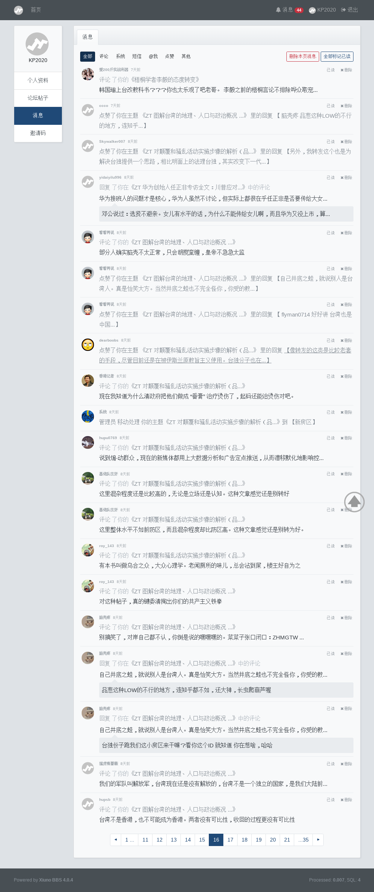
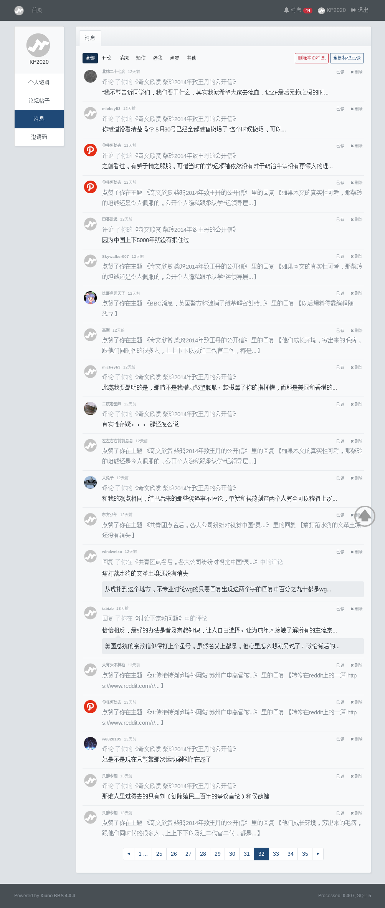

[此文](./README.md)已发[在品葱并引发共200楼讨论](https://pincong.rocks/article/1339), [后续](https://pincong.rocks/article/1354), 网友electron的[评论1:朝粪坑扔了块石头，结果被溅得一身了吧。](https://pincong.rocks/article/1345), [评论2: 他们没有恶意灌水，水平和素质比帝吧出征还是高不少，这点值得赞赏。](https://pincong.rocks/article/1370) 和 Reddit网友fengli03的评论:[说一下虎扑防区，以及最近兴起的r/China_irl版块](https://pincong.rocks/article/1348)， [2049bbs](https://2049bbs.xyz)站长Ciao评论：[“@goddamnit irl telegram 群里的有个叫欧阳的，简直就是标准网评员。https://t.me/China_irl ”](https://2049bbs.xyz/t/1111)

## 小站代表回应思路总结
跟技术出身的品葱管理员@小二 @admin 应对[时区泄漏](https://pincong.rocks/article/575)、支字头的正面回应及技术升级等处理方式相比，小站代表队的危机公关处理明显走的是一条思路清晰、套路明确、反应快速的对人不对事、模糊焦点的策略。这更进一步暴露对方政工背景。

* 一，坚壁清野，绝不正面回应对数据搜集的质疑。
* 二，坚定的将问题焦点引导至KP2020的诚信问题、人品问题，进而让观众不看质疑。
* 三，坚定的采取分化瓦解的路线，专注拉拢@小二 抹黑任何KP2020的嫌疑人。

# 附上原始消息数据供读者研究

## [品葱相应讨论贴](https://pincong.rocks/article/1339)

## KP2020 newjrs.xyz 发帖记录
KP2020 发帖并未违反小站版规

## KP2020 newjrs.xyz 申诉记录
KP2020 申诉受人身攻击，站方一直未按版规处理 （2019-4-19）

## KP2020 newjrs.xyz 消息记录（最新在前）
KP2020并非部分抹黑者所谓人人喊打的对象，对KP2020的人身攻击集中来自10个小站用户。

用户名 | 累计攻击次数(>3)
--- | --- 
脑壳疼 | 20
jayjoke | 13
roy_143 | 9
北镇抚司挥史 | 7
mo_n, [redditer](https://www.reddit.com/user/mo_n) | 5
badgirl1 | 4
奥贝斯坦 | 4
北纬二十七度 | 4
三上悠亚 | 4
冯迪特里施 | 4

（上述统计截至2019年4月25日，部分用户可能改名）

KP2020所发表的倾自由派观点反而获得了非常多小站用户的赞（共发26贴，累计约261赞），考虑大部分小站用户在墙内，这一点让人略感欣慰，说明中国前些年的教育还是成功的。

这个版本不包括已被jayjoke自己删掉的两条敏感留言

## 总结

这里总结小站疑似站长和部分网友在[品葱相应讨论贴](https://pincong.rocks/article/1339)的留言:

站方内容审查的理由有三

1. 为了在墙内生存
2. 为了保证内容质量
3. 为了保证立场不反华反共

本人可以理解小站和irl实施内容审查的理由，正如文中所言墙内小站审查较宽松，China_irl的审查则较缺乏公正度和规则意识。

小站网友针对[此文](./README.md)的主要回应集中在KP2020这个人

1. 非常坏，撒谎，不可信
2. 在小站内是过街老鼠，人人喊打
3. 故意挑动品葱和小站之间的战争

对此KP2020回应3个问题 （未获任何正面回应）

* 一、小站版规的管辖权是否可以延伸到品葱？如果是，请解释理由。如果不是，请举出kp2020在小站内部发帖违规的证据。如果没有小站内违规的证据，请依照版规撤销封禁处理。
* 二、kp2020在小站内举报反馈用户人身攻击，有明显的‘这个b’等脏话，为何不依照‘首先发起人生攻击者封禁’的版规处理当事人？
* 三、ymz根据什么数据判定pinconguser和kp2020是同一个人，请出示截图。

看问题需要区分[事实判断和价值判断](https://pincong.rocks/article/781)，KP2020的好坏是个价值判断，而结论应该建立在事实判断上。

小站网友回应的确认事实有二：

1. KP2020并未违反小站任何版规，但受到封禁 (小站版规管辖权在小站内，未约定小站之外行为守则——当然本人此次为小站完善版规作了贡献)
2. KP2020小站外[发文](./README.md)之前三日所申诉的三名人身攻击者并未按照版规受到站方禁言

KP2020的小站消息记录表明，实际上，KP2020并非部分抹黑者所谓人人喊打的对象，对KP2020的人身攻击集中来自少数活跃用户。

KP2020所发表的倾自由派观点反而获得了非常多小站用户的赞，考虑大部分小站用户在墙内，这一点让人略感欣慰，说明中国前些年的教育还是成功的。

KP2020 自2019-4-19正式申诉受到人身攻击，但站方直至封禁KP2020帐号均未按版规处理
